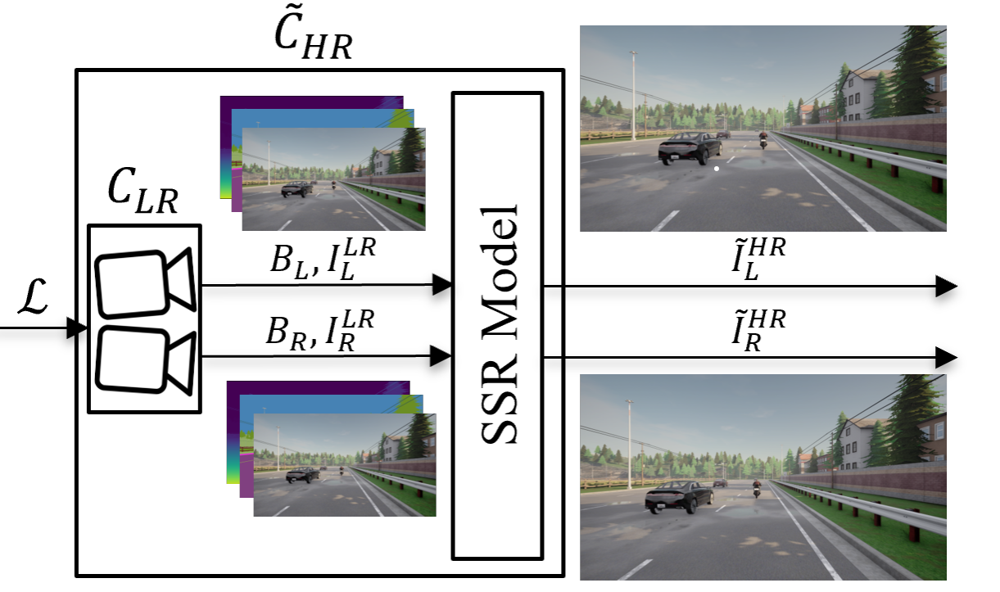

# Fast Stereo Camera Simulation using Super Resolution Techniques for Automotive Applications
We propose a method for acceleration of stereo camera simulation using stereo super resolution (SSR). This repository mainly contains the implementation of our SSR model (ETSSR) and other super-resolution (SR) models cited in the paper.

<p align="left"></p>

You can view the examples of ETSSR super-resolved images in the provided demo.

<p align="left"> <a href="https://drive.google.com/file/d/16g_auVrOOaZKLONwjdmndrd6Cj9VMKHY/view?usp=sharing"></a></p>

## Table of Contents
- [Installation](#Installation)
- [Training](#Training)
- [Testing](#Testing)
- [Profiling](#Profiling)
- [Acknowledgements](#Acknowledgements)

## Installation
### Dependencies
- Create a conda environment and activate it.

    $ conda create --name etssr python=3.6

    $ conda activate etssr

- Install PyTorch following [official instructions](https://pytorch.org/get-started/locally/)

The code has been tested on Ubuntu 18.04 with CUDA 11.4 and Pytorch 1.10.2.

- Install other python packages listed in requirements.txt

    $ pip install -r requirements.txt
### Dataset
- Download our [CMRSI dataset](https://livewarwickac-my.sharepoint.com/:u:/g/personal/u2039803_live_warwick_ac_uk/EcXSymz_RD9OjG3xUxGNb4oBhaQpcCRRFhKeLHhqGjsmFA?e=f42Tr7) and unzip it.

## Training

- To train the super-resolution (SR) models (including ETSSR) on CMRSI dataset, first generate image patches of CMRSI using:
```
python generate_patches.py
```
You need to set the directory of downloaded CMRSI dataset and the destination directory of image patches in the `generate_patches.py` code.
 
- Set the training parameters in the `train.yaml` file located in the `./configs` folder.

 You must change the **"data_dir"** to the path to the CMRSI image patches and **"test_data_dir"** to the path to the orignal CMRSI dataset.

- Run the training code using:

```
python train.py --cfg ./configs/train.yaml
```
The log of the training, including tensorboard plots and the model weights are saved in **"checkpoint_dir"/"exp_name"**.

## Testing

- To test the SR models on the CMRSI test set,  set the testing parameters in the `test.yaml` file located in the `./configs` folder.

You must change **"data_dir"** parameter in the config file to the path to CMRSI dataset.

- Run the test code using:


```
python test.py --cfg ./configs/test.yaml
```

The code calculates PSNR/SSIM on the CMRSI test set and saves output images in the **"checkpoint_dir"**.

## Profiling

To calculate the number of parameters and Flops of SR models run:

```
python profiler.py
```
Set the model name inside the python code.

## Acknowledgements

- State-of-the-art SR models implementations from [YingqianWang](https://github.com/YingqianWang/iPASSR)

- Swin-transformer Layers from [JingyunLiang](https://github.com/JingyunLiang/SwinIR)
 

