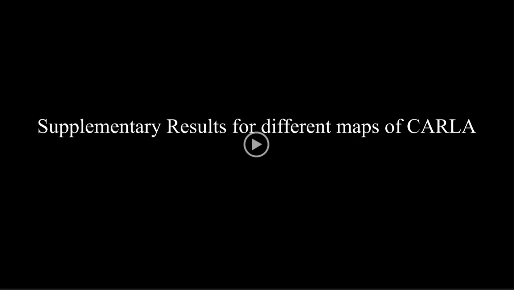

# Fast Stereo Camera Simulation using Super Resolution Techniques for Automotive Applications
We propose a method for acceleration of stereo camera simulation using stereo super resolution (SSR). This repository mainly contains the implementation of our SSR model (ETSSR) and other super-resolution (SR) models cited in the paper.

<p align="center"></p>


<p align="center"> <a href="https://drive.google.com/file/d/16g_auVrOOaZKLONwjdmndrd6Cj9VMKHY/preview"></a></p>

## Installation
### Dependencies
- Create a conda environment and activate it.

    $ conda create --name etssr python=3.6

    $ conda activate etssr

- Install PyTorch following [official instructions](https://pytorch.org/get-started/locally/)

The code has been tested on Ubuntu 18.04 with CUDA 11.4 and Pytorch 1.10.2.

- Install other python packages listed in requirements.txt

    $ pip install -r requirements.txt
### Dataset
- Download our [CMRSI dataset](https://pytorch.org/get-started/locally/) and unzip it.

## Training

- To train the super-resolution (SR) models, including ETSSR, on CMRSI dataset, first generate image patches of CMRSI using:
```
python generate_patches.py
```
You need to set the directory of downloaded CMRSI dataset and the destination directory of image patches in the `generate_patches.py` code.
 
- Set the training parameters in the `train.yaml` file in the `.\configs` folder.

 You must change the "data_dir" to the path to CMRSI image patches and "test_data_dir" to the path to orignal CMRSI path in the config file.

- Run the training code using:

```
python train.py --cfg .\configs\train.yaml
```
The log of training, including tensorboard plots and the weights of the model are saved accoding to "checkpoint_dir"  the config file.

## Testing

- To test the SR models on the CMRSI test set,  set the testing parameters in the `test.yaml` file in the `.\configs` folder.

You must change "data_dir" parameters in the config file to the path of CMRSI dataset.

- Run the test code using:


```
python test.py --cfg .\configs\test.yaml
```

The code calculates PSNR/SSIM on the test set and saves output images in the "checkpoint_dir".

## Profiling

To calculate the number of parameters and Flops of SR models run:

```
python profiler.py
```
Set the model name inside the python code.

## Acknowledgements

- State-of-the-art SR models implementations from [YingqianWang](https://github.com/YingqianWang/iPASSR)

- Swin-transformer Layers from [JingyunLiang](https://github.com/JingyunLiang/SwinIR)
 

